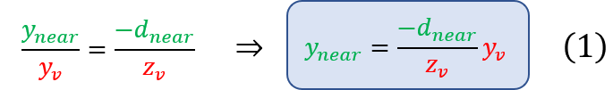
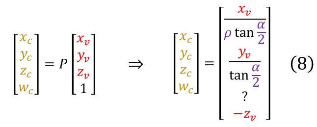
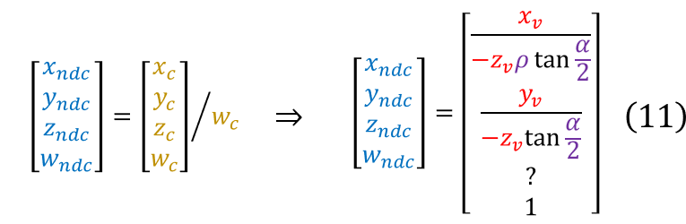
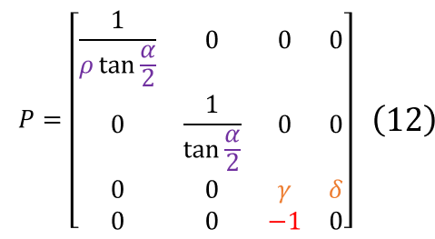
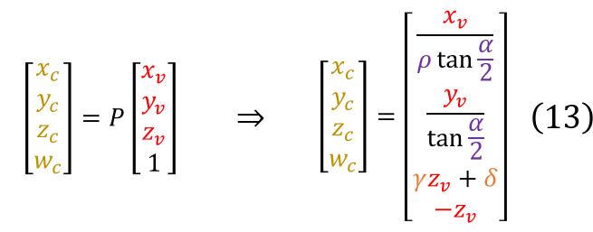

# Perspective projection

**Perspective projection** simulates the visual effect of real-world perspective, due to which
distant objects appear smaller than closer objects of the same size, and parallel lines approach
each other as they extend far from the observer:

    

 

Perspective projection works by mapping the observer's camera's visible *frustum* into a cube
centered at the origin with sides of length 2 (so that each coordinate ranges from -1 to +1).
The perspective frustum (see the picture below) is defined by four parameters:

1. The vertical *field of view*: an angle which defines the visible portion of the scene above and
below the observer;
2. The *aspect ratio* (AR): the proportion between the width and the height of the surface onto
which the scene is projected. Together with the FOV, the AR specifies the *horizontal* visible
portion of the scene;
3. The *near plane distance* (dnear): the *minimum* distance from the camera (along the
direction the camera is looking at) that an object must have in order to be visible. The near plane
can be thought of as the plane on which the projected image is formed;
4. The *far plane distance* (dfar): the *maximum* distance from the camera (along the
direction the camera is looking at) that an object must have in order to be visible.

    

 

Points that lie within the perspective frustrum defined above will be projected on the rendering
surface; points that lie outside the frustum will be clipped and not visible.

It is important to stress that in OpenGL's right-handed view system the camera looks down the
**negative** Z axis. Therefore, the Z coordinate of the near and far plane will be equal to
(respectively) **-dnear** and **-dfar** rather than to dnear and
dfar.

In order to realize the visual effect of real-world perspective, the X and Y coordinate of a
projected point needs to be scaled based on that point's distance from the camera. The picture
below illustrates the geometric relationship between the Y coordinate yv of a point
pv in view space and the Y coordinate ynear of the same point projected on
the near plane:

    

 

Once again, keep in mind that zv, the Z coordinate of point **pv** in view
space, is a *negative* value. Triangle similarity allows to determine the value of
ynear:

    

 

These Z-weighed coordinates are then normalized so that the visible coordinates conveniently fall
within the size-independent range [-1, +1]. To perform this normalization we must obtain the
maximum and minimum projected Y coordinates of the visible points. The picture below shows how the
projected visible Y range is defined by the intersection between the near plane and the angular
section defined by the FOV (denoted as 𝛼 in the picture below):

    

 

The ymax value can be computed from the FOV and the dnear distance through
simple trigonometry:

    

 

Since the vertical view range is symmetrical, ymin is equal to -ymax.
Equations (1) and (2) can be combined to obtain the *normalized device coordinate* (NDC)
ymin:

    

 

The computation of xnear is similar to the computation of ynear in equation
(1), yielding the following result:

    

Normalization of the X coordinate slightly differs from normalization of the Y coordinate though,
because the X range is not defined by means of an angular range, but rather through a stretching
factor relative to the Y range - the *aspect ratio*, denoted as 𝜌 in formula (5) below:

    

The value of xndc can then be obtained by normalizing xnear just like we did
for ynear in equation (6):

    

 

Affine coordinate system transformations (i.e. combinations of scaling, rotation, and translation
transformations) are realized through 4x4 matrix multiplication in linear algebra.
We should therefore be able to express the transformation that maps xv into
xndc and yv into yndc as a 4x4 matrix.
Unfortunately, the transformations in equation (3) and (6) are **not linear**, and cannot be
expressed as an affine matrix: there is no way to obtain the right side of (3) and (6) as the dot
product of some row vector **r** and **vp** (in particular, there is no way to get
-zv as a denominator).

We can, however, get close enough to our initial goal of expressing (3) and (6) as an affine
transformation matrix (ignore the placeholder question marks for the moment):

    

 

Pre-multiplication of view space point **pv** by matrix P above will give us the right
side of equations (3) and (6) for X and Y coordinates, but *without the division by
-zv*:

    

 

Vector **pc**=(xc, yc, zc, wc) is called the
**clip space** transformation of **pv**. Notice that even though the division by
-zv has not been performed, the value -zv has been stored in the
wc component of the output clip space vector.

So how do we get to perform that missing division and convert clip space coordinates into NDC
coordinates?
OpenGL's answer consists in letting the GPU perform it *implicitly*.
When the fragment shader is fed with (interpolated) vertex coordinates emitted by the vertex
shader, the GPU preliminarily performs an implicit division of such coordinates by the **w**
component of the corresponding vertex. This implicit division is called the **perspective divide**.
Compare the xndc and yndc components from equation (9) below with the right
side of equations (3) and (6) to confirm that matrix P from (7) encodes the correct transformation:

    

 

Encoding the perspective divisor in the wc component is not just a convenient trick: it
is the way [homogenous coordinates](https://en.wikipedia.org/wiki/Homogeneous_coordinates) are used
to represent points in projective geometry.

Our matrix (7) is not complete though - and as a consequence, neither the right sides of equations
(8) and (9) are: what we still miss are the matrix coefficients that allow computing the
zndc coordinate.

Although zndc is not used for rendering purposes (after all, points are rendered on a
2D surface) it is required for
[Z-buffering and depth testing](https://en.wikipedia.org/wiki/Z-buffering). Our goal is then to
replace the placeholder question marks in matrix (7) with coefficients that would yield the desired
value of zndc after matrix multiplication and perspective divide are performed. But what
is the desired value of zndc and how can we determine the right values for the missing
coefficients?

First of all, let's start by givin this coefficients the symbolic names 𝛾 and 𝛿:

    

 

The question mark on the right side of equation (8) can now be replaced by an expression in terms
of 𝛾 and 𝛿 to represent the clip space coordinate zc:

    

 

The corresponding NDC coordinate resulting from the perspective divide is then given by:

    

 

Our goal is to determine the values of 𝛾 and 𝛿 that cause the visible Z portion of the frustum
(i.e. the view space coordinate range [-dnear, -dfar]) to be mapped to the
NDC range [-1,+1]. Doing so amounts to resolving the linear system (13) below, where the notation
zndc(-znear) is used to denote the right side of equation (12) when the value
of zv is replaced by -znear (similarly for -zfar):

    

 

