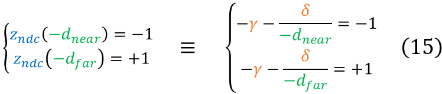
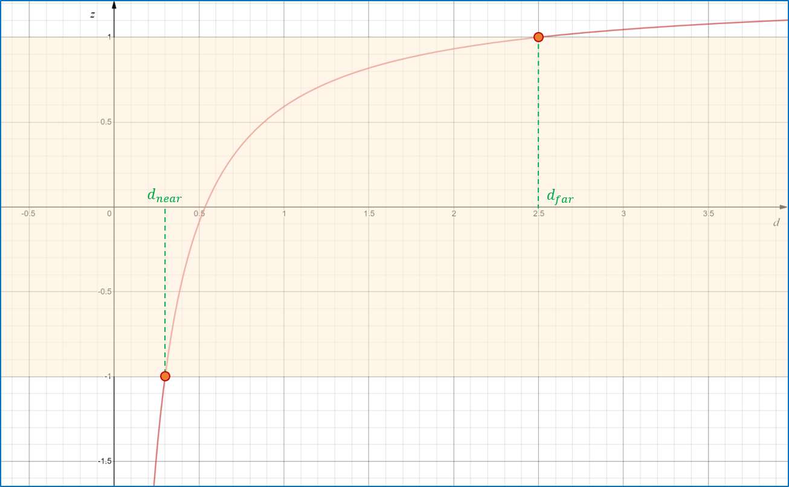

# Perspective projection

This tutorial provides a math-rich explanation of perspective projection and its realization in
the OpenGL rendering pipeline.
The projection matrix derived here is consistent with the one produced by the 
[`perspective()`](https://github.com/inviwo/glm/blob/master/glm/ext/matrix_clip_space.inl#L238-L252)
function of the [GLM library](https://github.com/inviwo/glm) when using the default configuration
settings (right-handed coordinate system, [-1,+1] normalization range).

The tutorial is organized into the following sections:

- [Introduction](#Introduction)
- [Projection transformation](#ProjectionTransformation)
- [Projection matrix](#ProjectionMatrix)
- [Clipping](#Clipping)
- [Perspective divide](#PerspectiveDivide)
- [Depth component](#DepthComponent)
- [Depth precision](#DepthPrecision)
- [Summary](#Summary)
- [Related links](#RelatedLinks)

### Introduction

**Perspective projection** simulates the visual effect of real-world perspective, due to which
distant objects appear smaller than closer objects of the same size, and parallel lines approach
each other as they extend far away from the observer:

    
     
    <a href="https://fspy.io/basics/">(source)</a>

 

Perspective projection works by mapping the observer camera's visible *frustum* (see the picture
below) into a cube centered at the origin. The **perspective frustum** is a pyramidal frustum
defined by four parameters:

1. The vertical *field of view*: an angle which defines the visible portion of the scene above and
below the observer;
2. The *aspect ratio* (AR): the proportion between the width and the height of the surface onto
which the scene is projected. Together with the FOV, the AR specifies the *horizontal* visible
portion of the scene;
3. The *near plane distance* (dnear): the *minimum* distance from the camera (along the
direction the camera is looking at) that an object must have in order to be visible. The near plane
is also the plane on which the projected image is formed;
4. The *far plane distance* (dfar): the *maximum* distance from the camera (along the
direction the camera is looking at) that an object must have in order to be visible.

    

 

Points that lie within the perspective frustrum defined above will be projected on the rendering
surface; points that lie outside the frustum will be clipped and not visible.

It is worth stressing that in OpenGL's right-handed coordinate system the camera looks down the
**negative** Z axis. Therefore, the Z coordinate of the near and far planes will be equal to
(respectively) **-dnear** and **-dfar** rather than dnear and
dfar.

### Projection transformation

In order to accomplish the visual effect of real-world perspective, the X and Y coordinates of a
projected point need to be scaled based on that point's distance from the camera. The following
diagram illustrates the geometric relationship between the Y coordinate yv of a 
view-space point **pv**=(xv,yv,zv) and the Y coordinate
ynear of **pv**'s projection *on the near plane*, which is the plane on which
the projected image is formed:

    

 

Once again, keep in mind that zv, the Z coordinate of view-space point
**pv**, is a *negative* value. Triangle similarity allows determining the value of
ynear:

    

 

The expression on the right side of equation (1) is well-defined if and only if zv is
different from 0 - notice that positive zv coordinates would be projected by (1) to
*negated* values of ynear, thus forming an upside-down image.

In order for OpenGL to deal with projected coordinates in a way that is independent of the size of
the rendering surface, the value obtained in (1) is **normalized** in such a way that visible
coordinates get mapped to the range [-1,+1].
To perform this normalization we must obtain the minimum and maximum Y coordinates of *visible*
points projected on the near plane.
These values are given by the intersection of the near plane and the angular section defined by the
FOV (denoted as 𝛼 in the picture below):

    

 

The ymax value can be computed from the FOV and the dnear distance through
simple trigonometry:

    

 

Since the vertical view range is symmetrical, ymin is equal to -ymax.
Equations (1) and (2) can be combined to obtain the **normalized device coordinate** (NDC)
ymin:

    

 

The computation of xnear is similar to the computation of ynear in equation
(1), yielding the following result:

    

 

Normalization of the X coordinate slightly differs from normalization of the Y coordinate though,
because the X range is not defined by means of an angular range, but rather through a stretching
factor relative to the Y range - the *aspect ratio* (AR), denoted as 𝜌 in formula (5) below:

    

 

The value of xndc can then be obtained by normalizing xnear just like we did
for yndc in equation (6):

    

 

### Projection matrix

The transformations in equations (3) and (6) are **non-linear**, and as such they cannot be applied
through multiplication by some matrix P; in particular, there is no way to obtain -zv as
a divisor for any arbitrary vector **pv** through multiplication by the *same* matrix P.
This is unfortunate, because representing linear transformations as matrices allows for efficient
and convenient processing.

We can, however, define a matrix P that *almost* represents transformations (3) and (6) - ignore
the placeholder question marks for the time being, they will be replaced later on:

    

 

If we multiply a view-space point **pv** (with a fourth component set to 1 for reasons
that will become apparent later on) by P we will get the right side of equations (3) and (6) for X
and Y coordinates *except* for the division by -zv (something we will fix
[in a later section](#PerspectiveDivide)):

    

 

Notice that even though the division by -zv was not performed, the value -zv
has been stored in the fourth component (wc) of the resulting clip-space vector.
Because of this, and because of equations (3) and (6), the following fundamental equivalence holds: 

    

 

Vector **pc**=(xc, yc, zc, wc) is called the
**clip space** projection of **pv**.
The reason why it is called *clip* space is that these coordinates are used by the GPU to perform
*clipping*.

### Clipping

Clipping is the operation that determines which portions of a (projected) primitive lie within the
visible NDC unit cube and which do not, and excludes the latter from rendering.
The picture below illustrates the concept for the XY plane, but it is important to keep in mind
that clipping is performed against a 3D *volume*:

    

 

It is interesting to observe that clipping can actually cause *new* primitives to be generated, as
is the case for the triangle near the bottom-right corner of the clipping area in the picture
above.

Clipping is an optimization that can significantly speed up the rendering pipeline, but it is not
*just* an optimization.
[As previously discussed](#PositiveZValues), the transformation realized by projection matrix (7)
will project vertices with positive zv coordinates (i.e. vertices lying *behind* the
camera) on the near plane with *mirrored* XY coordinates.
Since we do not want objects behind the camera to be displayed on the the screen - let alone
mirrored -, we need to
prevent such points from being further processed by the rendering pipeline - which is exactly what
clipping is for.

As we can see from equation (8), the *negated* value of zv is stored in wc,
the W component of clip-space point **pc**.
We want to clip points with a positive zv, i.e. points with a *negative* wc;
and since the projection transformation is not defined for wc=0, only points with a
*positive* wc clip-space coordinate shall eventually be rendered.

Because we constructed matrix (7) with the intent of mapping visible points to the origin-centered
unit cube *in NDC coordinates*, and because - as shown in equation (9) NDC coordinates are obtained
by dividing clip space coordinates by their wc component, the following conditions must
be satisfied in order for a point *not* to be clipped:

    

 

We can see from equation (10) that the clipping volume for a clip-space point is a cube whose size
is equal to the distance from the camera of the corresponding view-space point.

### Perspective divide

When we introduced clip-space coordinates in equation (8) we mentioned that even though the
division by -zv was not performed when multiplying the view-space point
**pv** by the projection matrix (7), the value -zv happened to be stored in
the fourth component (wc) of the clip-space projected vector.
Of course this is not by accident: the value of the third element of the last row of matrix (7) has
been set to -1 precisely for this purpose.

The rationale behind this is that with OpenGL the GPU performs the division by wc
*implicitly* whenever the fragment shader is fed with (interpolated) vertex coordinates emitted by
the vertex shader.[1](#HomogenousCoordinates)
This implicit division by wc is called the **perspective divide** and it is only
performed for vertices that have not been clipped.

When combined with matrix P from (7), the perspective divide completes the transformation of
view-space points into their NDC projection:

    

 

It is easy to verify that the X and Y components on right side of equation (11) do indeed coincide
with the right sides of equations (3) and (6).

Storing the perspective divisor in the wc component is something more than just a
convenient trick for realizing the perspective divide: it is a well-known and elegant way of
generalizing Cartesian coordinates to 
<a href="https://en.wikipedia.org/wiki/Homogeneous_coordinates"><i>homogenous coordinates</i></a>.

Our projection matrix (7) is still incomplete though, and so are (as a consequence) the right sides
of equations (8) and (11): we are missing the matrix coefficients that allow computing the
zndc coordinate, also known as the *depth* component.

 

### Depth component

Although the zndc coordinate is not used for rendering purposes (after all, points are
rendered on a 2D surface) it is required for
[Z-buffering and depth testing](https://en.wikipedia.org/wiki/Z-buffering).
The purpose of depth testing is to correctly handle the rendering of overlapping primitives that
get projected onto the same XY coordinates on the screen.

After the clip-space coordinates emitted by the vertex shader have been converted to NDC
coordinates through the perspective divide, and assuming those coordinates fall within the unit
cubical range of visible coordinates, the GPU needs to determine whether or not the corresponding
fragment ought to be rendered on the screen.
To make this decision the GPU keeps track, for every fragment, of the NDC Z coordinate of the last
vertex that was rendered on that fragment.
A special buffer with the same width and height of the screen - the **depth buffer** - is used to
store these coordinate values.
If the vertex to be rendered on a given fragment has an NDC Z coordinate which is greater than the
value stored in the depth buffer for that fragment (meaning that it is farther from the camera than
the vertex that was last rendered on the same fragment), the vertex is discarded and does not get
rendered.[1](#EarlyDepthTesting)

To obtain the NDC Z coordinate of a projected point, the placeholder question marks in our
perspective matrix (7) need to be replaced with coefficients that would yield the desired values
of zndc after matrix multiplication and perspective divide.
But what are the desired values of zndc, and how to determine the coefficients that
yield them?

First of all, let's start by giving these coefficients a symbolic name. We will use 𝛾 and 𝛿:

    

 

The question mark on the right side of equation (8) can now be replaced by an expression in terms
of 𝛾 and 𝛿 to represent the clip space coordinate zc:

    

 

The corresponding NDC coordinate resulting from the perspective divide is then given by:

    

 

Our goal is to find out the values of 𝛾 and 𝛿 that cause the visible Z portion of the frustum (i.e.
the view-space coordinate range [-dnear, -dfar]) to be mapped to the NDC
range [-1,+1]. Doing so amounts to resolving the linear system (15) below, where the notation
zndc(-znear) is used to denote the right side of equation (14) with the value
of zv replaced by -znear (similarly for zv=-zfar):

    

 

To solve system (15) we first simplify the signs in the two equations, then we solve the upper
equation for 𝛾 as a function of 𝛿:

    

 

We can then replace the value of 𝛾 from (16) in the lower equation and determine the value of 𝛿 as
in the following derivation:

    

 

By replacing the value of 𝛿 from (17) in the upper equation of (16) we can determine the value of
𝛾 as well:

    

 

Now that both coefficients 𝛾 and 𝛿 are known we can provide the complete definition of the
parametric projection matrix P introduced in (12):

    

 

1 On modern GPUs the depth testing can be performed <i>before</i> the fragment shader is
run. This potentially allows skipping time-consuming lightSystem calculations if the GPU can deduce
that the fragment won't eventually be visible due to occlusion by another vertex.
This process is called *early depth testing*.
In order for early depth testing to be possible, the fragment shader shall not modify the NDC Z
coordinate.

 

### Depth precision

It is worth stressing that the mapping of view-space Z coordinates to NDC Z coordinates is *not*
linear: the view-space Z coordinate which lies halfway between -znear and 
-zfar does *not* get mapped to the NDC coordinate 0.
The non-linearity of the mapping stems from the fact that zndc (just like all NDC
coordinates) is *inversely* proportional to zv.

The graph below depicts the relationship between a view-space point's distance from the camera
(on the horizontal axis) and its projected zndc (on the vertical axis) when
dnear=0.3 and dfar=2.5.

    

 

As the diagram shows, the distance range that gets mapped to the zndc range [-1,0] is
significantly narrower than the one that gets mapped to [0,+1] - even more so when the value of
dfar - dnear is larger than in the example above, as is usually the case in
video games.
In practice, this means that more floating-point precision is available for the depth value of
objects that are close to the camera than for those that are far away.
This is convenient, because closer objects are generally what the viewer focuses on, and a higher
depth precision helps reducing artifacts and contributes to a more realistic rendering of the most
relevant portions of the scene.

 

### Summary

When we multiply a view-space point vector
**pv**=(xv, yv, zv, wv) by projection matrix
(19) we obtain its *clip space* transformation
**c**=(xc, yc, zc, wc):

    

 

The GPU uses these coordinates to perform clipping. If the vertex coordinates fall within the
clip volume - which is defined as a cube centered at the origin with side length equal to the value
of the clip-space wc component, see equation (10) - the perspective divide is performed.
From the perspective divide we obtain the NDC coordinates:

    

 

It is not difficult to verify that the zndc component of the resulting vector in
equation (21) above assumes the value -1 when zv=-znear, and the value +1
when zv=-zfar.

If the Z component of the NDC coordinate obtained from the perspective divide is larger than the
value currently stored in the depth buffer for the target fragment, the vertex is discarded (and if
early depth testing[1](#EarlyDepthTesting) is availble, the fragment shader is not run).

After obtaining the NDC coordinates, the rendering pipeline will have to transform them into screen
coordinates.
This transformation consists of a trivial offsetting and scaling operation; however, since it is
not very closely related to the projection process, it will not be discussed here.

### Related links

- [OpenGL Projection Matrix](http://www.songho.ca/opengl/gl_projectionmatrix.html)
- [The Perspective and Orthographic Projection Matrix](https://www.scratchapixel.com/lessons/3d-basic-rendering/perspective-and-orthographic-projection-matrix/opengl-perspective-projection-matrix)
- [Homogeneous Coordinates](http://www.songho.ca/math/homogeneous/homogeneous.html)